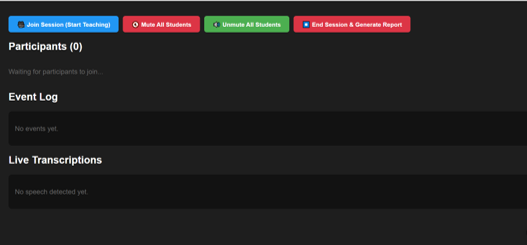
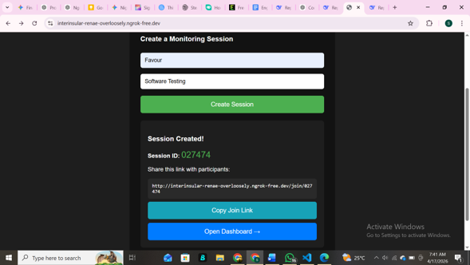
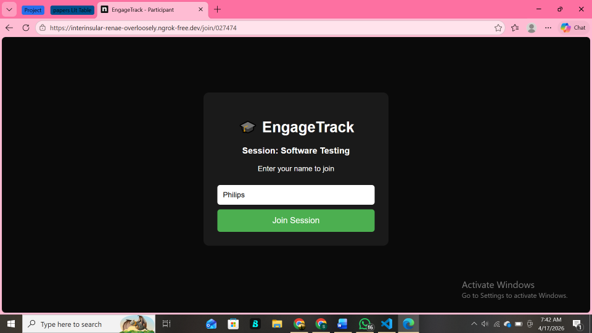
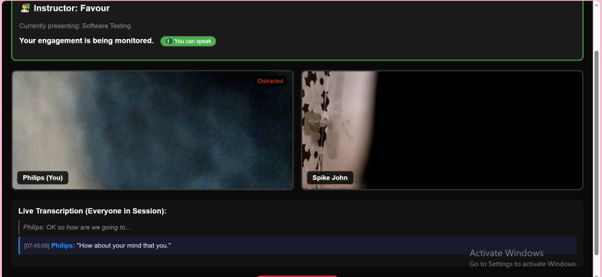
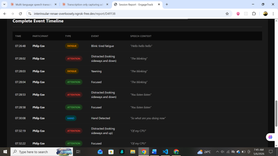
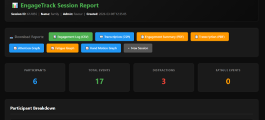

# EngageTrack — Intelligent Contextual Behavioural Analysis for Real-Time Engagement Monitoring

---

## Overview

EngageTrack is an intelligent, context-aware, real-time engagement monitoring system designed for virtual and online learning environments. It captures multimodal behavioral data from standard webcams using **MediaPipe Face Mesh** and **Hands** libraries, extracting facial landmarks to compute the **Eye Aspect Ratio (EAR)** for blink/fatigue detection, the **Mouth Aspect Ratio (MAR)** for yawn detection, and a six-point head pose estimation model to determine gaze direction as pitch and yaw angles. Hand gesture detection is performed concurrently to identify hand raises.

Contextual enrichment is achieved through the **Web Speech API**, which provides real-time speech transcription, associating verbal context with behavioral events. The system is built on a **Flask-SocketIO** backend with **SQLite** persistence, and a browser-based frontend using **PeerJS** for WebRTC peer-to-peer video communication. It features an administrative dashboard for live participant status monitoring, event logging, mute control, and session management. Upon session conclusion, the system generates comprehensive reports in **CSV** and **PDF** formats, including engagement graphs.



---

## Research Context

This project addresses a critical challenge in modern educational environments: monitoring student engagement in real time, particularly where large class sizes limit an instructor's ability to identify and support disengaged learners. Existing automated solutions often rely on single-channel inputs and lack the contextual intelligence to distinguish genuine disengagement from benign behavior.

EngageTrack fills five persistent research gaps identified in the literature:

1. **Server-side processing** — introduces prohibitive latency
2. **Single-channel approaches** — produce ambiguous classifications (e.g., cannot distinguish note-taking from distraction)
3. **No contextual speech data** — few systems integrate verbal context with visual indicators
4. **Privacy-invasive design** — centralized raw video storage raises concerns
5. **Incomplete end-to-end implementations** — no system combines video communication, dashboards, and report generation

> **Important:** EngageTrack provides computational indicators of observable behavior. It does not claim to directly measure a person's internal psychological state, attention, emotion, or learning outcome.

---

## Development Evolution

### Stage 1 — GUI Prototype
The initial proof-of-concept implementation focused on validating the engagement detection pipeline and dashboard concept using OpenCV, MediaPipe, and Tkinter. This validated the core computer vision and engagement logic before scaling to a web architecture.

### Stage 2 — Full-Stack Web Application *(this repository)*
The prototype was upgraded into a browser-based architecture using Flask. This introduced:
- Multi-user sessions with unique session IDs
- Browser-based participant access via shareable URLs
- WebRTC video communication via PeerJS
- Socket.IO real-time communication
- Browser-side MediaPipe processing (privacy-preserving)
- Live speech transcription with contextual event attachment
- Instructor controls (mute/unmute, session management)
- Participant status updates in real time
- Downloadable post-session reports (CSV, PDF, graphs)

---

## System Architecture

```
                         ┌─────────────────────┐
                         │   Instructor        │
                         │   Dashboard         │
                         └──────────┬──────────┘
                                    │
                                    │ Socket.IO
                                    │
                         ┌──────────▼──────────┐
                         │   Flask Server      │
                         │                     │
                         │  Session Mgmt       │
                         │  Event Mgmt         │
                         │  Routing            │
                         │  Reporting          │
                         └───────┬───────┬─────┘
                                 │       │
                       Socket.IO │       │ HTTP
                                 │       │
                    ┌────────────▼─┐   ┌─▼──────────────┐
                    │ Participants │   │ Session /      │
                    │              │   │ Report Pages   │
                    └───────┬──────┘   └────────────────┘
                            │
                 ┌──────────┼──────────┐
                 │          │          │
             MediaPipe   Speech     PeerJS
             Face/Hands  Recognition WebRTC
                 │          │          │
                 └──────────┼──────────┘
                            │
                    ┌───────▼────────┐
                    │ Engagement     │
                    │ Logic          │
                    └───────┬────────┘
                            │
                    ┌───────▼────────┐
                    │ Event Logging  │
                    │ & Session Data │
                    └───────┬────────┘
                            │
                    ┌───────▼────────┐
                    │ Session Report │
                    └────────────────┘
```

### Three-Tier Architecture

| Tier | Components | Purpose |
|------|-----------|---------|
| **Client** | MediaPipe (Face Mesh + Hands), PeerJS/WebRTC, Web Speech API, Socket.IO client, HTML/CSS/JS | Local processing, video streaming, transcription, UI |
| **Application Server** | Flask, Flask-SocketIO, routes.py, events.py, engagement_logic.py, utils.py | HTTP routing, real-time events, engagement analysis, report generation |
| **Data** | SQLite DB, logs/ folder | Session persistence, CSV/PDF/PNG reports |

---

## Key Features

### 1. Session Creation
Instructors create a monitoring session by providing their name and a session name. The application generates a unique 6-character session ID and a shareable participant join URL.



### 2. Multi-Participant Sessions
Participants join via browser using the generated link, providing their name before entering. The system was tested with up to 5 concurrent participants.



### 3. Real-Time Video Communication
PeerJS/WebRTC provides browser-to-browser video communication. Participants appear as individual video tiles, creating a meeting experience similar to common video conferencing platforms.

### 4. Real-Time Attention Monitoring
The browser captures participant video and processes facial landmarks using MediaPipe Face Mesh (468 landmarks). Head pose estimation (pitch, yaw, roll) determines attention state:

| State | Condition |
|-------|-----------|
| **Focused** | abs(yaw) ≤ 25° AND abs(pitch) ≥ 90° (sustained for 3s) |
| **Distracted** | yaw or pitch outside focused range |
| **Unknown** | No face detected |
| **Left Session** | Participant disconnected |

### 5. Fatigue Detection

| Metric | Method | Threshold | Fatigue Trigger |
|--------|--------|-----------|-----------------|
| **Blink** | EAR < 0.25 for 3+ frames | 0.25 | 5+ blinks in 10s |
| **Yawn** | MAR > 0.7 for 5+ frames | 0.7 | 2+ yawns in 60s |

### 6. Hand Activity Monitoring
MediaPipe Hands detects hand landmarks. The system identifies:
- **Hand Raised** — wrist Y < eye Y × 0.4
- **Hand Detected** — frequent movement (std dev > 0.04 over 3s window)

### 7. Live Speech Recognition
The Web Speech API captures participant speech with continuous recognition and interim results. Final transcripts are sent to the server and broadcast to all session participants, providing contextual enrichment for behavioral events.



### 8. Instructor Controls
The admin dashboard provides:
- Join session as participant (start teaching)
- Mute/unmute individual participants
- Mute/unmute all participants
- End session & generate report
- Live participant status with color-coded engagement states
- Real-time event log with speech context
- Live transcription feed


### 9. Real-Time Event Logging
Behavioral observations are converted into contextual events:

```
[07:28:04] [Philip Eze] Attention: Focused
[07:28:53] [Philip Eze] Attention: Distracted (looking sideways and down)
    Context: "You listen listen"
[07:28:03] [Philip Eze] Fatigue: Yawning
    Context: "The blinking"
[07:30:08] [Philip Eze] Hand Motion: Hand Detected
    Context: "So what are you doing now"
```



### 10. Session Reports
Upon ending a session, EngageTrack generates:

| File | Format | Description |
|------|--------|-------------|
| `{session_id}_engagement_log.csv` | CSV | All logged events with timestamps |
| `{session_id}_transcription.csv` | CSV | All speech transcripts |
| `engagement_log_summary.pdf` | PDF | Formatted event log with speech context |
| `transcription_summary.pdf` | PDF | Formatted transcription document |
| `attention_over_time.png` | PNG | Attention state timeline graph |
| `fatigue_events.png` | PNG | Yawn and blink fatigue scatter plot |
| `hand_motion_events.png` | PNG | Hand raise and motion scatter plot |



---

## Detection Pipeline

```
Participant joins session
        ↓
Request webcam + mic (getUserMedia 640×480)
        ↓
Initialize PeerJS (connect peers, start video grid)
        ↓
Init MediaPipe + Speech API (FaceMesh, Hands, recognition)
        ↓
Emit landmarks (2 Hz) — face + hand arrays via Socket.IO
        ↓
Server: compute metrics (EAR, MAR, pitch, yaw, hand)
        ↓
Threshold exceeded?
        ↓ No ─────────────────────────┐
        ↓ Yes                         │
Log event with speech context      │
(timestamp, type, description)       │
        ↓                          │
Broadcast to dashboard              │
(new_event, participant_status)     │
        ↓                          │
Session ended? ── No ──────────────┘
        ↓ Yes
Generate reports + save DB
(CSV, PDF, graphs, SQLite)
```

---

## Technology Stack

### Backend
- **Python 3.10** — backend logic
- **Flask + Flask-SocketIO** — web framework and real-time communication
- **Flask-CORS** — cross-origin request handling
- **eventlet** — asynchronous server backend
- **OpenCV (cv2)** — head pose estimation (solvePnP)
- **NumPy** — numerical operations
- **Matplotlib** — engagement graph generation
- **fpdf2** — PDF report generation
- **SQLite** — session data persistence

### Frontend
- **HTML5, CSS3, JavaScript** — user interface
- **Socket.IO** — real-time bidirectional communication
- **Jinja2** — server-side templating

### Computer Vision
- **MediaPipe Face Mesh** — 468 facial landmarks (client-side, CDN)
- **MediaPipe Hands** — 21 hand landmarks (client-side, CDN)
- **Browser Camera APIs** — getUserMedia

### Communication
- **WebRTC** — peer-to-peer video/audio
- **PeerJS** — WebRTC abstraction layer
- **PeerJS Server (Node.js)** — signaling infrastructure

### Speech
- **Web Speech API** — browser-native speech transcription

### Development & Deployment
- **Python venv** — virtual environment
- **Node.js / npm** — PeerJS server dependencies
- **ngrok** — temporary public access during testing

---

## Project Structure

```
engage-track/
│
├── app.py                    # Flask app entry point, SocketIO setup
├── config.py                 # Detection thresholds and constants
├── database.py               # SQLite database initialization and queries
├── engagement_logic.py       # Core engagement state machine
├── events.py                 # SocketIO event handlers
├── routes.py                 # HTTP route definitions
├── utils.py                  # Report generation, EAR/MAR/head pose math
│
├── peerjs_server.js          # Node.js PeerJS signaling server
├── package.json              # Node.js dependencies
├── package-lock.json         # Locked Node.js dependency versions
│
├── requirements.txt          # Python dependencies
├── .env                      # Environment variables (SECRET_KEY, PORT)
├── .env.example              # Example environment file (safe for GitHub)
├── .gitignore                # Git ignore rules
├── LICENSE                   # MIT License
├── README.md                 # Project documentation
│
├── templates/                # Jinja2 HTML templates
│   ├── index.html            # Create session page
│   ├── participant.html      # Participant join + video room
│   ├── dashboard.html        # Admin live monitoring dashboard
│   ├── report.html           # Post-session report view
│   └── history.html          # Past sessions list
│
├── static/
│   ├── css/                  # Stylesheets
│   │   ├── index.css
│   │   ├── dashboard.css
│   │   ├── participant.css
│   │   ├── report.css
│   │   └── history.css
│   │
│   └── js/                   # Frontend JavaScript
│       ├── index.js
│       ├── dashboard.js
│       └── participant.js
│
├── screenshots/              # Application preview images
│   ├── admin-dashboard.png
│   ├── event-timeline.png
│   ├── live-transcription.png
│   ├── participant-session.png
│   ├── session-creation.png
│   └── session-report.png
│
└── logs/                     # Generated reports + SQLite DB (gitignored)
    └── .gitkeep
```

> **Runtime files excluded from version control:** `.env`, `venv/`, `node_modules/`, `logs/*.csv`, `logs/*.pdf`, `logs/*.png`, `__pycache__/`, `.pyc` files.

---

## Installation

### Prerequisites
- Python 3.10+
- Node.js (for PeerJS server)
- Modern web browser (Chrome/Edge recommended)
- Webcam and microphone

### 1. Clone the repository

```bash
git clone https://github.com/favibe/EngageTrack.git
cd EngageTrack
```

### 2. Set up Python environment

```bash
# Create virtual environment
python -m venv venv

# Windows
venv\Scripts\activate

# macOS/Linux
source venv/bin/activate

# Install Python dependencies
pip install -r requirements.txt
```

### 3. Set up Node.js dependencies

```bash
npm install
```

### 4. Configure environment

Create a `.env` file in the project root:

```env
SECRET_KEY=your-secret-key-here
PORT=5000
```

> **Never commit `.env` to GitHub.** An `.env.example` file is provided showing required variables without real secrets.

---

## Running the Application

EngageTrack requires **two servers** running simultaneously:

### Terminal 1 — Flask Backend

```bash
# Activate virtual environment first
venv\Scripts\activate  # Windows
source venv/bin/activate  # macOS/Linux

python app.py
```

Runs on: `http://localhost:5000`

### Terminal 2 — PeerJS Signaling Server

```bash
node peerjs_server.js
```

Runs on: `http://localhost:9000`

### Access the application

1. Open `http://localhost:5000` in your browser
2. Enter admin name and session name → **Create Session**
3. Share the generated join link with participants
4. Open the **Dashboard** to monitor engagement in real time

---

## Making the Application Accessible Over the Internet

For testing across different devices or networks, **ngrok** was used to expose the local Flask application:

```bash
ngrok http 5000
```

ngrok generates a temporary public URL (e.g., `https://example.ngrok-free.app`). This URL can be shared with participants for remote joining.

> The ngrok URL is temporary and should not be hard-coded into the project or committed to GitHub.

---

## Browser Permissions

EngageTrack requires the following browser permissions:
- **Camera access** — for MediaPipe face/hand landmark detection
- **Microphone access** — for Web Speech API transcription and WebRTC audio

Speech Recognition support depends on browser capabilities. Chrome/Edge recommended.

---

## Skills Demonstrated

| Area | Skills |
|------|--------|
| **Full-Stack Web Development** | Flask, SocketIO, HTML/CSS/JS, Jinja2 templating |
| **Real-Time Computer Vision** | MediaPipe Face Mesh, MediaPipe Hands, facial landmark processing, head pose estimation |
| **Multimodal Data Fusion** | Visual (EAR/MAR/pose/hand) + audio (speech) + contextual (transcript attachment) |
| **Peer-to-Peer Networking** | WebRTC, PeerJS, ICE/STUN/TURN concepts |
| **State Machine Design** | Real-time engagement detection with cooldowns, consistency thresholds, sliding windows |
| **Database Design** | SQLite schema, JSON serialization, in-memory caching for low latency |
| **Automated Reporting** | CSV generation, PDF generation (fpdf2), Matplotlib data visualization |
| **Privacy-Preserving Architecture** | Client-side landmark extraction, no raw video storage, P2P video routing |
| **Cross-Platform Browser APIs** | Web Speech API, MediaPipe CDN, getUserMedia |

---

## What I Learned

### Backend Development
- Flask application structure, routing, session management
- Server-side event handling with Socket.IO
- REST-style endpoints and real-time communication
- Modular Python architecture (separation of routes, events, logic, utils, database)

### Frontend Development
- HTML/CSS/JavaScript integration with dynamic DOM manipulation
- Browser media APIs (getUserMedia, SpeechRecognition)
- Real-time UI updates via Socket.IO
- Client-server bidirectional communication

### Computer Vision
- MediaPipe Face Mesh (468 landmarks) and Hands (21 landmarks)
- Facial landmark processing for EAR, MAR, and head pose
- OpenCV solvePnP for 3D head pose estimation from 2D landmarks
- Real-time browser-based CV processing

### Real-Time Systems
- Socket.IO events for low-latency updates
- WebRTC peer-to-peer video communication
- PeerJS for simplified WebRTC signaling
- Multi-participant state management

### Speech Processing
- Browser Speech Recognition API
- Live transcription with interim and final results
- Session-level transcription feeds and contextual event attachment

### Software Engineering
- Modular project organization with clear separation of concerns
- Environment management with `.env` and `venv`
- Dependency management (`requirements.txt`, `package.json`)
- Git/GitHub workflow with `.gitignore` for sensitive/runtime files
- Debugging across frontend and backend components

---

## Future Improvements

1. **Multi-User Scalability** — Switch from full-mesh PeerJS to Selective Forwarding Unit (Janus/Jitsi Videobridge) for large classrooms
2. **Server-Side Transcription** — Replace Web Speech API with Groq Whisper API for cross-platform compatibility (especially Android)
3. **GPU Acceleration** — Enable WebGL/MediaPipe GPU inference to reduce CPU load (67–72% on dual-core)
4. **Per-Participant Calibration** — Baseline EAR/MAR/pose calculation per individual for improved accuracy
5. **Longitudinal Analytics** — Track engagement trends across multiple sessions for the same user
6. **LMS Integration** — Moodle/Canvas integration for correlating engagement with academic performance
7. **Deep Learning Emotion Recognition** — Classify confusion, boredom, frustration beyond binary attention states
8. **Automated Intervention Alerts** — Notify instructors when sustained distraction or critical fatigue is detected
9. **Docker Containerization** — Easy deployment on cloud platforms (Render, Railway, AWS)
10. **Privacy & Ethics** — Encrypted storage, configurable data retention, pseudonymized reports, institutional ethical review

---

## Limitations

- **Browser compatibility** — Speech Recognition may not work on all browsers/devices (known issue on Android Chrome 120+)
- **Hardware dependency** — High CPU usage (67–72%) on dual-core without GPU acceleration
- **Network conditions** — WebRTC connectivity depends on NAT/firewall configuration
- **Temporary public access** — ngrok URLs are ephemeral, not suitable for production
- **Heuristic indicators** — Behavioral signals are threshold-based proxies, not definitive psychological measurements
- **Scale testing** — Validated with max 5 participants; large-scale stress testing needed
- **One-way monitoring** — Administrator monitors participants; no automated intervention mechanisms yet

---

## Related Project

This repository is the **full-stack evolution** of the original EngageTrack GUI prototype.

| Stage | Repository | Description |
|-------|-----------|-------------|
| **Stage 1** | `favibe/engagetrack-gui-prototype` *(separate repo)* | Tkinter/OpenCV proof-of-concept |
| **Stage 2** | `favibe/EngageTrack` *(this repo)* | Flask/WebRTC multi-user web app |

The two repositories demonstrate the progression from initial concept to a deployable web-based system.

---

## License

This project is licensed under the MIT License.

See the [LICENSE](LICENSE) file for details.

---

## Author

**Ibe Favour**

Software Engineering | Data Analytics | Intelligent Systems

- GitHub: [@favibe](https://github.com/favibe)
- LinkedIn: [LinkedIn]
- Email: [Email]

---

## Project Status

| Property | Value |
|----------|-------|
| **Status** | Completed academic/research prototype |
| **Architecture** | Full-stack web application |
| **Primary Backend** | Flask + Flask-SocketIO |
| **Real-Time Communication** | Socket.IO + PeerJS/WebRTC |
| **Computer Vision** | MediaPipe (client-side) |
| **Speech** | Web Speech API (browser-native) |
| **Database** | SQLite |
| **Development Environment** | Python venv + Node.js |
| **External Testing** | ngrok |
| **Tested Participants** | Up to 5 concurrent |


> **Final Year Project** — B.Sc. Software Engineering  
> **Author:** Ibe Favour  
> **GitHub:** [favibe/EngageTrack]( https://github.com/favibe/EngageTrack.git)
